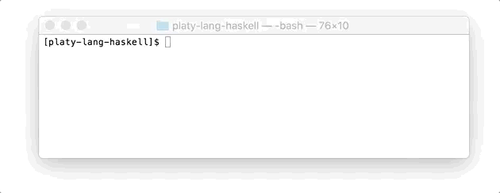

# Platy Programming Language

| branch | Travis status|
| --- | --- |
| [`master`](https://github.com/nwtgck/platy-lang-haskell/tree/master) | [](https://travis-ci.com/nwtgck/platy-lang-haskell) |
| [`develop`](https://github.com/nwtgck/platy-lang-haskell/tree/develop) | [](https://travis-ci.com/nwtgck/platy-lang-haskell) |

Platy is a small programming language for practice of creating language. The compiler is a [LLVM](https://llvm.org/)-based compiler.
It was designed to realize the following three ideas.

1. **Declarative**
1. **Statically typed**
1. **Simple to implement**


## Installation

This installation allows you to use `platyc` compiler.

### Mac

```bash
brew install llvm-hs/homebrew-llvm/llvm-5.0
cd <this repo>
stack build
stack install
```

### Ubuntu 16.04

```bash
sudo apt-add-repository --yes "deb http://apt.llvm.org/xenial/ llvm-toolchain-xenial-5.0 main"
sudo apt update
sudo apt install -y llvm-5.0-dev
cd <this repo>
stack build
stack install
```

If you use 14.04 (Trusty), you should replace the `sudo apt-add-repository ...` with `sudo apt-add-repository --yes "deb http://apt.llvm.org/trusty/ llvm-toolchain-trusty-5.0 main"`.

(useful link: https://apt.llvm.org/)


## Fibonacci function in Platy



```clojure
                                                                        ; [Pseudo code]
                                                                        ;
(@func fib [(:: n Int)] Int                                             ; func fib(n :: Int) -> Int =
    (@if (or [(eq-int [n, 0]), (eq-int [n, 1])])                        ;   if (n == 0 || n == 1)
        1                                                               ;     then 1
        (add-int [(fib [(sub-int [n, 2])]), (fib [(sub-int [n, 1])])])  ;     else fib (n - 2) + fib (n - 1)
    )                                                                   ;
)                                                                       ;
                                                                        ;
(@func main [] Unit                                                     ; func main() -> Unit =
    (@let [                                                             ;   let
        ; Calculate fib(1)                                              ;     // Calculate fib(1)
        (= fib1  Int (fib [1])),                                        ;     fib1 :: Int   = fib(1)
        ; Print it                                                      ;     // Print it
        (= _1 Unit (print-int [fib1])),                                 ;     _1   :: Unit  = print_int(fib1)
                                                                        ;
        ; Calculate fib(30)                                             ;     // Calculate fib(30)
        (= fib30 Int (fib [30])),                                       ;     fib30 :: Int  = fib 30
        ; Print it                                                      ;     // Print it
        (= _2 Unit (print-int [fib30]))                                 ;     _2    :: Unit = print_int(fib30)
    ] Unit)                                                             ;   in Unit
)
```

You can find actual code in [platy_programs/should_pass/fib.platy](platy_programs/should_pass/fib.platy).

## Features

* Declarative
* Statically typed
* Strict evaluation (not lazy evalluation)
* Impure function
* Non-functional


### What Platy haves
* Variable binding
* Function definition
* `Int`
* `Char`
* `Bool`
* `Unit`


### What Platy doesn't have
* Lambda expression
* Currying
* Partial application
* Structure
* Generic structure, template class
* Generic function
* Pattern Matching
* `String` type
* Separation of side effects (IO monad or [Uniqueness type](https://en.wikipedia.org/wiki/Uniqueness_type))
* Assignment
* Exception handling
* Object-oriented (no class, no method, no polymorphism)
* Type class, interface, trait
* Package, module
* Union type
* Garbage collection
* Type alias
* Type family
* Macro
* Foreign Function Interface


## Why S-expression-like syntax?

Because it keeps easy to create parser. In addition, S-expression is very scalable and expandable.